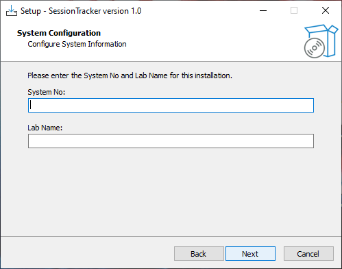

# Session Tracker — DigiLogBook Client

**Automated lab session logging for institutional environments.**
A Java-based desktop application with a background Windows Service, offline-first SQLite persistence, and seamless Supabase cloud synchronization.

<br/>

[](https://openjdk.org/)
[](https://docs.oracle.com/javase/tutorial/uiswing/)
[](https://www.sqlite.org/)
[](https://supabase.com/)
[](LICENSE)

<br/>

[Features](#-key-features) · [Architecture](#-system-architecture) · [Workflow](#-system-workflow) · [Configuration](#-configuration) · [Installation](#-installation--deployment) · [Roadmap](#-roadmap)

</div>

---

## Overview

Session Tracker eliminates manual paper logbooks in college computer labs. It silently records each student's login and logout time — automatically, accurately, and without interrupting their workflow.

Built on a resilient **offline-first architecture**, all data is committed to an embedded SQLite database first, then synchronized to a centralized **Supabase PostgreSQL** cloud database whenever connectivity is available.

---

## 🏗 System Architecture

This repository is the **client-side module** of the broader [DigiLogBook](https://github.com/mohammedrayyan12/JavaSwing-DigiLogBook) ecosystem. The system is intentionally split into two repositories for a clean separation of concerns:

| Module | Repository | Responsibility |
|---|---|---|
| **Client — Session Tracker** *(this repo)* | [@CodingMirage](https://github.com/CodingMirage) | Desktop UI, local SQLite persistence, Windows event tracking, sync triggers |
| **Server — DigiLogBook** | [@mohammedrayyan12](https://github.com/mohammedrayyan12) | Supabase infrastructure, API endpoints, fail-safe sync, data validation |

---

## ✨ Key Features

| Feature | Description |
|---|---|
| 🚀 **Zero-Friction Auto-Start** | Launches automatically on Windows boot via registry-registered batch scripts |
| 🖥 **Lightweight UI** | Swing interface prompts for credentials and exits immediately — no persistent UI memory usage |
| 🕒 **Full Lifecycle Tracking** | Captures both login (via UI prompt) and logout (via Windows Service shutdown intercept) |
| 🗄 **Offline-First Storage** | Embedded SQLite ensures zero data loss during power failures or network outages |
| ☁️ **Intelligent Cloud Sync** | Pushes completed sessions to Supabase PostgreSQL at boot and login via REST + Edge Functions |
| 📦 **Single-EXE Deployment** | Entire stack — JAR, JRE, service, scripts — packaged into one installer |
| ⚙️ **Externalized Configuration** | Institution-specific settings isolated in `config.properties`, no recompilation needed |

---

## 🛠 Technology Stack

### Application Core
- **Java (Swing)** — UI and application logic
- **Gradle** — Build automation, dependency resolution, Fat JAR generation
- **GSON** — JSON serialization and API payload construction

### System Integration
- **Windows Service** — Background daemon for OS shutdown/logoff event detection
- **Batch Scripting (.bat)** — Automated service registration and environment setup

### Data & Cloud
- **SQLite** — Embedded local database for offline-first persistence
- **PostgreSQL** — Cloud database engine (hosted via Supabase)
- **Supabase** — Backend-as-a-Service providing the PostgreSQL instance and API layer
- **Supabase Edge Functions** — Serverless functions for secure sync and validation

---

## 🧠 System Workflow

The application operates on a strict event-driven lifecycle to ensure accuracy and minimal footprint.

<div align="center">
  
  <br/>
  <sub>Login on System boot</sub>
</div>


### Step-by-Step Breakdown

**1. System Boot & Initialization**
The pre-registered Java application launches automatically when Windows starts.

**2. Initial Cloud Sync**
Before the UI appears, the app pushes any incomplete sessions from previous offline usage to Supabase.

**3. Credential Prompt**
The GUI prompts the student for their **Name** and **USN** (University Serial Number).

**4. Local Commit & App Exit**
Login timestamp and credentials are written to SQLite. A secondary cloud sync fires. The GUI exits completely.

**5. Background Service**
A silent Windows Service monitors the system's power state throughout the session.

**6. Shutdown Intercept**
On power-off or logoff, the Service captures the exact termination timestamp and updates the active SQLite session record.

**7. Next-Boot Reconciliation**
On the following startup, the now-complete session record (with both login and logout times) is pushed to the cloud.

---

## ⚙️ Configuration

### `config.properties`

All institution-specific parameters are externalized in a single configuration file, enabling deployment across multiple labs without touching source code.

```properties
# Database
LOCAL_TABLE=sessions
LOCAL_TABLE_CONFIG=CONFIGURATION_TABLE
LOCAL_DB=user_sessions.db

# Cloud / Supabase
CLOUD_FUNCTION_INSERT=insert-records
CLOUD_FUNCTION_SYNC=fetch-all-config
PROJECT_URL=https://[YOUR_SUPABASE_ID].supabase.co
ANON_KEY=[YOUR_JWT_ANON_KEY]

# Environment
ADMIN_PASSWORD=root
SYSTEM_NO=M-1
LAB_NAME=Lab
```

### State Management

To avoid redundant cloud requests, a local flag file tracks configuration sync state:

```
%APPDATA%\SessionTracker\config_synced.flag
```

Configuration is fetched from Supabase **once per machine**. To force a refresh, click **Sync** in the UI or use the Admin panel.

---

## 🔍 Core Mechanics

### Boot Sequence (`Main.java`)

```
setupDatabase()          → Initialize SQLite, ensure `sessions` table exists
syncOnce()               → Fetch latest config from Supabase Edge Function
syncLocalDataToRemote()  → Push all unsynced local records to cloud
GUI Launch               → Start Swing UI (MyFrame)
```

### Smart USN Decoding

Student USNs follow a structured format (e.g., `1VI21CS045`). The application validates against:

```
^1[A-Z]{2}\\d{2}[A-Z]{2}\\d{3}$
```

And automatically derives:

- **Semester** — from the current academic year and enrollment year
- **Department** — from the alphabetic department code (`CS`, `EC`, etc.)
- **Batch** — from the enrollment year digits

<div align="center">
  
  <br/>
  <sub>Automatic metadata extraction from the student's USN</sub>
</div>

---

## 🗂 Project Structure

```
SessionTracker/
├── src/
│   └── main/java/
│       ├── Main.java                  # Entry point, boot sequence orchestration
│       ├── AppBackend.java            # Core business logic
│       ├── CloudDatabaseUpload.java   # Supabase REST API integration
│       ├── ConfigLoader.java          # config.properties reader
│       ├── ConfigSyncManager.java     # Cloud config sync with flag management
│       ├── MyFrame.java               # Main Swing window
│       └── MyPanel.java               # UI panel and form logic
│
├── gui/
│   ├── app-gui.jar                    # Compiled Fat JAR
│   └── config.properties             # External configuration file
│
├── images/                            # Repository images (README assets)
├── inno script.txt                    # Inno Setup compiler script
├── install.bat                        # Service registration script
└── uninstall.bat                      # Service removal script
```

---

## 📦 Installation & Deployment

Deployment uses **Inno Setup** to package the entire stack into a single self-contained installer.

> [!IMPORTANT]
> **A pre-built installer is not provided.** The application requires database connection details that are specific to each environment (host, port, credentials, table names). You must configure `config.properties` and compile the installer yourself before deploying.

### Step 1 — Clone the Repository

Download or clone this repository to your local machine:

```bash
git clone https://github.com/CodingMirage/session-tracker.git
```

### Step 2 — Configure the Application

Navigate to the configuration file:

```
Installer/gui/config.properties
```

Open it in any text editor and update the database connection parameters to match your environment:

```properties
LOCAL_TABLE=sessions               # Do not change — hardcoded in the Windows Service
LOCAL_TABLE_CONFIG=CONFIGURATION_TABLE
CLOUD_TABLE=your_table_name
CLOUD_TABLE_CONFIG=config_table_name
LOCAL_DB=user_sessions.db          # Do not change — hardcoded in the Windows Service
JDBC_URL_CLOUD=your_db_url
JDBC_USERNAME_CLOUD=your_db_username
JDBC_PASSWORD_CLOUD=your_db_password
```

> [!NOTE]
> Ensure the configured database is reachable from every machine the application will be installed on. Incorrect credentials will prevent the application from starting or syncing.

### Step 3 — Install Inno Setup

Download and install [Inno Setup](https://jrsoftware.org/isinfo.php) if you don't already have it.

### Step 4 — Compile the Installer Script

Open the provided `.iss` file located in the installer directory using Inno Setup, then compile it.

Ensure the following files are present before compiling:

```
Installer/
├── gui/
│   ├── app-gui.jar
│   └── config.properties      ← must be configured first
├── jre/
├── service/
├── install.bat
└── uninstall.bat
```

### Step 5 — Run the Generated Installer

After compilation, the installer `.exe` is created in the output directory specified in the `.iss` script. Deploy this file to your target lab machines.

When run on a target machine:

1. Enter the **`SYSTEM_NO`** for that machine (e.g., `LAB-M1`)
2. The installer patches `config.properties` automatically
3. `install.bat` executes silently to register the Windows Service

<div align="center">
  
  <br/>
  <sub>Inno Setup installer — configure once, deploy across all lab machines</sub>
</div>

> [!TIP]
> If you encounter issues during configuration or compilation, please [open an issue](../../issues) in this repository.

---

## 🖼 Screenshots

<div align="center">

| Login Prompt | Admin Login |
|:---:|:---:|
|  |  |

</div>

---

## 🔮 Roadmap

| Status | Feature |
|---|---|
| 🔜 | **Admin Dashboard UI** — View and filter local SQLite logs directly from the GUI |
| 🔜 | **Auto-Updater** — Pull latest JAR from GitHub Releases automatically |
| 🔜 | **Encrypted Local Storage** — Integrate SQLCipher to encrypt `user_sessions.db` |
| 🔜 | **Real-Time Occupancy** — Upgrade sync to Supabase Realtime WebSocket for live dashboards |

---

---

## 🤝 Contributing & Forking

This project is built to be adapted. Every institution has different lab layouts, policies, and infrastructure needs — so rather than trying to make Session Tracker a one-size-fits-all product, it's designed to be **forked and customized**.

If you're a developer looking to build something similar (or improve on this), feel free to:

- **Fork the repository** and adapt it to your own institution's requirements
- Swap out Supabase for your preferred backend (Firebase, self-hosted Postgres, etc.)
- Extend the USN decoding logic for different university ID formats
- Build out the Admin Dashboard or other roadmap items above
- Submit a PR if you build something you think others could benefit from

No permission needed — just credit the original where it's due. If you do build your own version, I'd genuinely love to hear about it. Open an issue or drop a link in a discussion thread!

---

## 📄 License

Distributed under the **MIT License**. See [`LICENSE`](LICENSE) for details.

---

## 🙏 Acknowledgments

- Badge assets by [Shields.io](https://shields.io)
- Cloud infrastructure by [Supabase](https://supabase.com)
- Server-side module by [@mohammedrayyan12](https://github.com/mohammedrayyan12)

---

<div align="center">
  <sub>Built with ☕ in Java · Part of the <a href="https://github.com/mohammedrayyan12/JavaSwing-DigiLogBook">DigiLogBook</a> ecosystem</sub>
</div>
