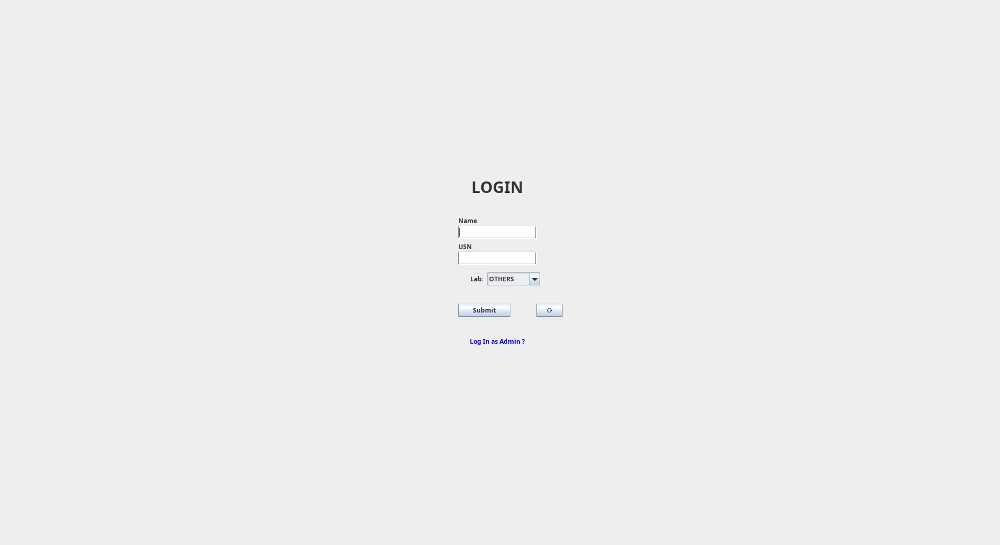
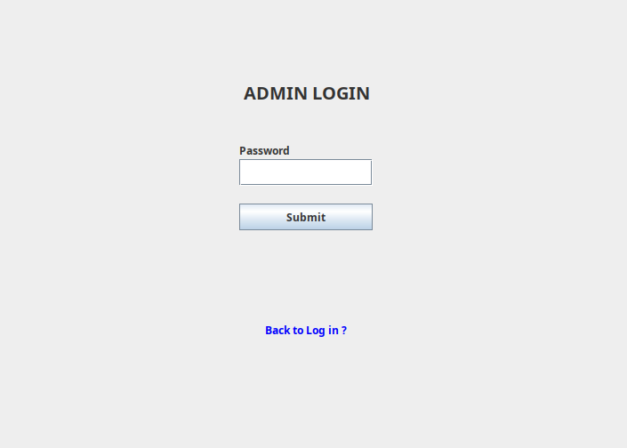
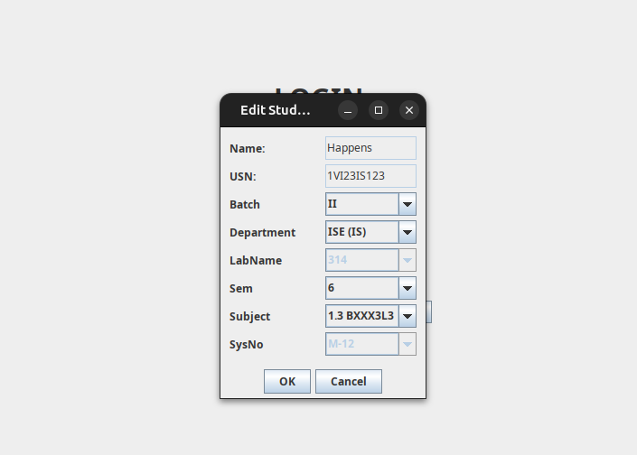

# 🖥️ Session Tracker — Client Application (v2)

[](https://www.java.com)
[](https://docs.oracle.com/javase/tutorial/uiswing/)
[](https://sqlite.org)
[](https://gradle.org)
[](LICENSE)

**Automated lab session tracking — students log in at boot, logout is captured silently at shutdown.**

---

## 🔗 Project Structure

Session Tracker is the **client-side** component of a two-part distributed system:

| Component | Role | Repo |
|-----------|------|------|
| **Session Tracker (This Repo)** | Desktop client — captures student login at startup and shutdown time in the background | [JavaSwing-SessionTracker](https://github.com/mohammedrayyan12/JavaSwing-SessionTracker/tree/v2) |
| **DigiLogBook (Server)** | Desktop admin app — imports, views, filters, exports and cloud-syncs all session records | [JavaSwing-DigiLogBook](https://github.com/mohammedrayyan12/JavaSwing-DigiLogBook) |

> **Session Tracker runs on every lab PC.** DigiLogBook runs on the admin/staff PC and is used to manage the collected data.

---

## 🎯 Overview

**Session Tracker** is a Java Swing application designed to **automatically replace manual lab logbooks** in college computer labs. It runs silently in the background and requires minimal interaction from students.

### How It Works

1. **On Windows startup**, the Swing login dialog appears automatically.
2. The student enters their **Name**, **USN**, and selects their **Lab** from a dropdown.
3. On submission, the **login time is recorded** locally and the UI closes — the system is ready to use.
4. A **background Windows service** monitors for system shutdown and records the **logout time** when the PC is powered off.
5. The complete session record (login + logout) is stored in a local **SQLite** database and synced to the **Supabase cloud** (via the DigiLogBook server) when connectivity is available.

---

## 🖼️ Screenshots

### Student Login Screen
> Appears automatically on Windows startup — students enter Name, USN, and select their lab.



### Admin Login
> Password-protected admin access for managing student records directly from the client.



### Edit Student Record
> Admin panel to view and edit student details including Batch, Department, Lab, Semester, Subject, and System Number.



---

## ✨ Features

- 🚀 **Auto-starts on Windows boot** via startup registry or Task Scheduler
- 🖥️ **Lightweight Java Swing UI** — minimal footprint, closes immediately after login
- 🕒 **Automatic login & shutdown time capture** — no manual logbook needed
- 🗄️ **Local SQLite storage** — works fully offline
- ☁️ **Cloud sync** — sessions are pushed to Supabase via the DigiLogBook server when online
- 🔒 **Admin panel** — password-protected interface for viewing and editing records
- 📋 **Dynamic lab dropdown** — lab options pulled from the shared `configuration_options` table
- 🔄 **Refresh button** — syncs configuration options (labs, subjects, etc.) on demand
- 🎓 **Designed for college computer labs** — minimal student interaction required

---

## 🛠️ Tech Stack

| Technology | Purpose |
|------------|---------|
| Java (Swing) | Desktop GUI |
| SQLite (via JDBC) | Local session storage |
| Supabase / Edge Functions | Cloud sync (via DigiLogBook server) |
| Windows Service / Task Scheduler | Background shutdown detection & auto-start |
| Gradle | Build system |

---

## 🚀 Getting Started

### Prerequisites

- **Java JDK 11 or higher**
- **Windows OS** (auto-start and shutdown service are Windows-specific)
- **Gradle** (bundled via Gradle Wrapper — no installation needed)

### Build from Source

```bash
# Clone the repository (v2 branch)
git clone -b v2 https://github.com/mohammedrayyan12/JavaSwing-SessionTracker.git
cd JavaSwing-SessionTracker

# Build the fat JAR
./gradlew shadowJar

# Run
java -jar build/libs/JavaSwing-SessionTracker-all.jar
```

**Windows users:**
```bat
gradlew.bat shadowJar
java -jar build/libs/JavaSwing-SessionTracker-all.jar
```

---

## ⚙️ Configuration & Database

Session Tracker shares its database schema with DigiLogBook. Sessions are stored locally in SQLite and synced to Supabase.

### Local Database Schema

```sql
CREATE TABLE sessions (
    session_id  TEXT PRIMARY KEY,  -- Unique session identifier
    login_time  TEXT NOT NULL,     -- ISO8601 timestamp (recorded at login)
    logout_time TEXT,              -- ISO8601 timestamp (recorded at shutdown)
    usn         TEXT NOT NULL,     -- Student University Seat Number
    name        TEXT NOT NULL,     -- Student name
    details     TEXT               -- JSON blob for dynamic fields (Lab, Subject, Sem, etc.)
);
```

The `details` field stores flexible metadata as JSON:

```json
{
  "Sem": "6",
  "Department": "ISE (IS)",
  "Subject": "1.3 BXXX3L3",
  "Batch": "II",
  "labName": "314",
  "SysNo": "M-12"
}
```

### Configuration Options

Lab names, subjects, departments, batches, and other dropdowns are sourced from the shared `configuration_options` table — the same table managed by DigiLogBook. This means any category or item added in DigiLogBook automatically reflects in the Session Tracker's dropdowns after a refresh.

---

## 🏗️ Auto-Start & Background Service Setup

> ⚠️ Administrator privileges are required for the following setup steps.

### Auto-Start on Windows Boot

Add the JAR to Windows startup using **Task Scheduler**:

1. Open **Task Scheduler** → Create Basic Task
2. Set trigger: **At log on** (or At startup)
3. Set action: Start a program → `java -jar "C:\path\to\SessionTracker.jar"`
4. Enable: **Run with highest privileges**

Alternatively, add a shortcut to the Windows Startup folder:
```
%APPDATA%\Microsoft\Windows\Start Menu\Programs\Startup
```

### Background Windows Service (Shutdown Detection)

A separate Windows service must be installed to capture the logout/shutdown time. Refer to the service setup documentation included in the repository. The service writes the shutdown timestamp to the local SQLite database when a system shutdown event is detected.

---

## 🔗 Dependency: DigiLogBook

Session Tracker **depends on DigiLogBook** being configured for full functionality:

- DigiLogBook manages the **Supabase cloud backend** and Edge Functions
- DigiLogBook populates the **`configuration_options`** table (labs, subjects, departments, batches) that Session Tracker reads for its dropdowns
- DigiLogBook provides the admin interface for **viewing, filtering, and exporting** all session data collected by Session Tracker

**👉 Set up DigiLogBook first:** [JavaSwing-DigiLogBook](https://github.com/mohammedrayyan12/JavaSwing-DigiLogBook)

Follow the [SETUP_DATABASE.md](https://github.com/mohammedrayyan12/JavaSwing-DigiLogBook/blob/main/SETUP_DATABASE.md) guide in the DigiLogBook repository to configure Supabase before deploying Session Tracker on lab PCs.

---

## 📂 Project Structure

```
JavaSwing-SessionTracker/
├── src/main/java/
│   ├── Main.java                  # Entry point — launches login dialog on startup
│   ├── LoginForm.java             # Student login UI (Name, USN, Lab)
│   ├── AdminLogin.java            # Admin password authentication screen
│   ├── AdminPanel.java            # Admin record editing interface
│   ├── DatabaseManager.java       # SQLite CRUD operations
│   ├── CloudSync.java             # Supabase sync logic
│   └── ConfigLoader.java          # Loads configuration_options for dropdowns
├── gradle/                        # Gradle wrapper
├── build.gradle                   # Gradle build config
├── gradlew / gradlew.bat          # Gradle wrapper scripts
├── README.md                      # This file
└── LICENSE                        # MIT License
```

> Note: File names above are illustrative based on the application's behavior. Refer to `src/main/java/` in the repository for exact class names.

---

## 🤝 Contributing

Contributions are welcome!

1. **Fork** the repository
2. **Create** a feature branch: `git checkout -b feature/YourFeature`
3. **Commit** your changes: `git commit -m 'feat: add YourFeature'`
4. **Push** to your branch: `git push origin feature/YourFeature`
5. **Open** a Pull Request

Use conventional commit prefixes: `feat:`, `fix:`, `docs:`, `refactor:`

---

## ⚠️ Known Limitations & Scope

- **Architecture:** This fork (v2) is maintained as a **standalone executable JAR**. It focuses on application logic and database synchronization, omitting the native Windows service wrappers (.exe/service wrappers) found in the original upstream.
- **System Integration:** While the core app is platform-independent, features like *automatic startup* and *background shutdown detection* are Windows-specific and require external configuration (e.g., Windows Task Scheduler or .bat scripts) as they are not natively bundled.
- **Permissions:** Administrative privileges are required for local SQLite write-access and for setting up OS-level automation tasks.
- **Academic Context:** This is an academic project developed for college lab environments; it is not currently hardened for high-security production deployments.

---

## 📄 License

This project is licensed under the **MIT License** — see the [LICENSE](LICENSE) file for details.

---

## 👨‍💻 Author & Acknowledgments

**v2 Independently maintained by:** [@mohammedrayyan12](https://github.com/mohammedrayyan12)  
**Originally forked from:** [@CodingMirage/JavaSwing-SessionTracker](https://github.com/CodingMirage/JavaSwing-SessionTracker)

- [SQLite JDBC](https://github.com/xerial/sqlite-jdbc) — lightweight local database
- [Supabase](https://supabase.com) — open-source cloud backend
- [Gradle](https://gradle.org) — build automation

---

**⭐ If this project helped you, consider giving it a star!**

[Report Bug](https://github.com/mohammedrayyan12/JavaSwing-SessionTracker/issues) · [Request Feature](https://github.com/mohammedrayyan12/JavaSwing-SessionTracker/issues) · [DigiLogBook Server →](https://github.com/mohammedrayyan12/JavaSwing-DigiLogBook)